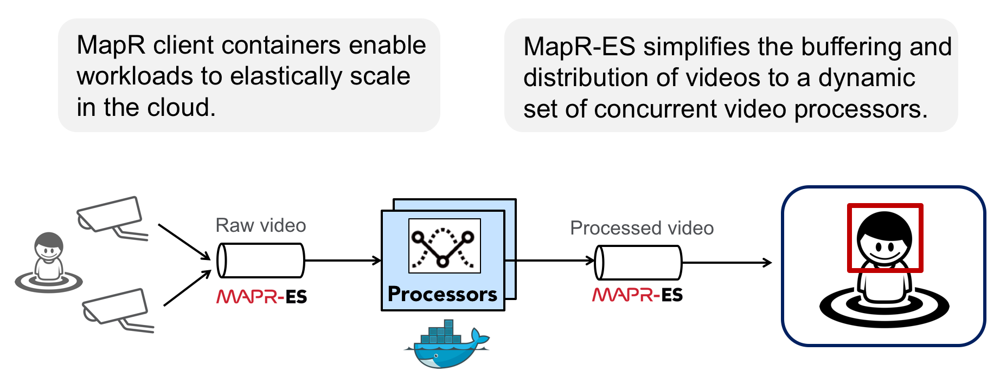
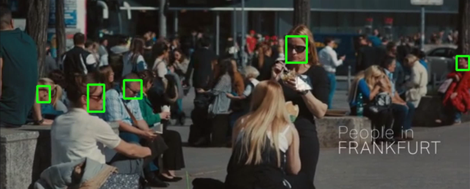
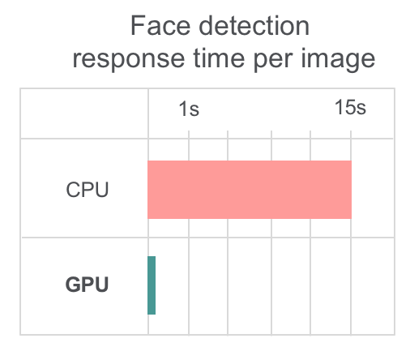
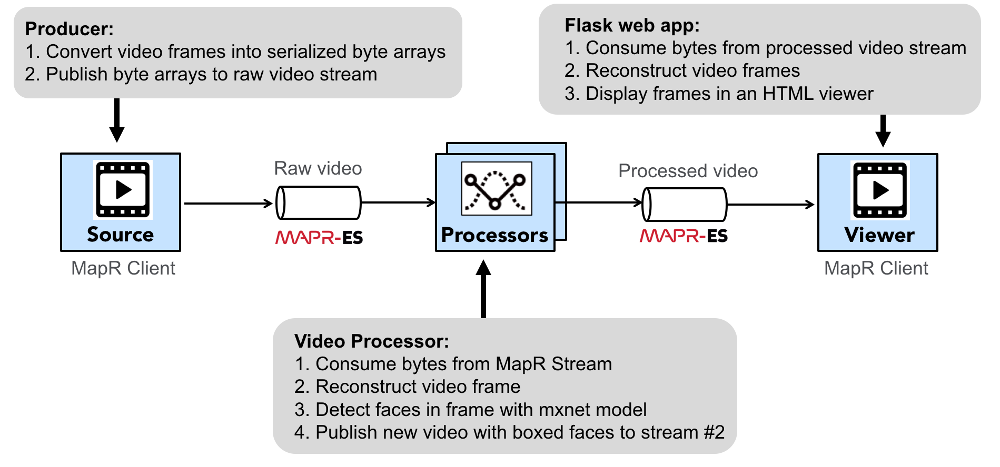

# Executive Summary



This project focuses on demonstrating the following two points:

1. **MapR Streams (MapR-ES) makes it easier to distribute fast data, like video.** It simplifies the buffering and connection management that's normally complicated when you have a dynamic number of concurrent stream consumers. MapR-ES also allows you to partition streams so you can split up time consuming tasks like face detection across multiple consumers without duplicating data.
2. **MapR client containers (MapR PACC) for Docker enable workloads to elastically scale in the cloud.** This makes it possible to utilize hardware more efficiently and meet SLAs more effectively.

# Introduction

<a href="https://vimeo.com/89718925"></a>

The data that can be generated by detecting faces in video feeds is providing new quantitative paths for a wide range of applications including smart spaces, ad analytics, surveillance, and even [political science](https://blog.archive.org/2018/05/18/tv-news-record-six-takeaways-from-adding-hillary-clinton-barack-obama-more-to-face-o-matic-facial-detection/). However, implementing real-time face detection is challenging on two fronts:

1. Video feeds generate high throughput data streams
2. Real-time face detection requires expensive GPU processors

To make matters worse, many applications need to simultaneously process multiple videos (e.g. webcam feeds) at near real-time frame rates. Until recently, the assumption has been that a dedicated GPU must be allocated for each video feed. With the advent of containerization, distributed pub/sub messaging services, and elastic GPUs in the cloud, we can architect applications that more efficiently utilize hardware to process multiple high speed video feeds within containerized processes that are easy to scale.

In this project we demonstrate an application designed to detect faces in multiple video feeds with an efficient use of GPU hardware. This architecture is generally applicable to any application that involves transporting and processing fast data with linear scalablity.

## Why Docker?

Docker makes it easy to run multiple video producers and consumers (face detectors), and when they're packaged with the MapR PACC (Persistent Application Client Container), they can maintain access to a MapR cluster and the video streams hosted on that cluster even though the containers themselves are ephemeral. 

In other words, by dockerizing the video consumers, face detection processes can be provisioned on-the-fly when new video feeds demand faster processing, and discovering those streams will never be a problem since MapR’s global namespace ensures stream locations never change.

## Why distributed Pub/Sub?

Distributed pub/sub messaging services are typically used for communication between services. When messages are produced faster than they are consumed, these services store the unconsumed messages in memory. As such, they provide a convenient decoupleing that allows producers to send data to consumers without the burdon of maintaining connections across a variable number of consumers.

# Why GPUs?

Real-time face detection requires high speed processors. Video processing on traditional CPUs can only be done by significantly compromising the fidelity and timeliness of video frame processing.

To see how fast you can classify a video without a GPU, change `ctx = mx.gpu(args.gpuid)` to `ctx = mx.cpu(0)` in `consumer/deploy/mapr_consumer.py`. 



# Can pub/sub streaming really handle video???

Pub/sub streaming systems like Kafka and MapR Streams have traditionally been thought of as a solution for inter-service communication, rather than a distribution mechanism for fast data streams like video. However, this demo proves that video can be distributed through pub/sub systems like MapR Streams, and in fact doing so offers advantages with regard to buffering data between fast producers and slower consumers, as well as distributing fast data across a set of concurrent asynchronous stream processors.

However, you can't expect video frames to be processed by concurrent consumers in order. Although expecting ordering from a Kafka-like pub/sub system is not a best practice, it's still possible to get value from the face detection data even if consumers process stream messages out of order. For example, by persisting that data in a database, we can query it using BI tools to answer questions with real business value, like what are people looking at (smart spaces), when do TV channels run commercial breaks (ad analytics), when does a person enter a passageway (security), etc.?

# Functional Spec



# Demo Procedure

## Stand up a MapR cluster and docker host

Provision a 3 node MapR cluster, and an ubuntu machine with a GPU. This will be our mapr client and docker host.

# Create the Dockerfile

Create a MapR PACC image, as described [here](https://maprdocs.mapr.com/52/AdvancedInstallation/CreatingPACCImage.html):

```
wget http://package.mapr.com/releases/installer/mapr-setup.sh -P /tmp
chmod 700 ./mapr-setup.sh
./mapr-setup.sh docker client
```

Make sure to create PACC with ubuntu16.

Open `./docker_images/client/Dockerfile` and replace the "FROM" command to following:

```FROM nvidia/cuda:9.0-base-ubuntu16.04```

Now build the new PACC image with cuda included:

```
cd ./docker_images/client/
docker build -t pacc_nvidia:cuda-9.0-base .
```


# Create streams on the mapr cluster

```
maprcli stream delete -path /tmp/rawvideostream
maprcli stream delete -path /tmp/identifiedstream
maprcli stream delete -path /tmp/processedvideostream
maprcli stream create -path /tmp/rawvideostream
maprcli stream edit -path /tmp/rawvideostream -produceperm p -consumeperm p -topicperm p
maprcli stream topic create -path /tmp/rawvideostream -topic topic1 -partitions 6
maprcli stream create -path /tmp/processedvideostream
maprcli stream edit -path /tmp/processedvideostream -produceperm p -consumeperm p -topicperm p
maprcli stream topic create -path /tmp/processedvideostream -topic topic1 -partitions 1
maprcli stream create -path /tmp/identifiedstream
maprcli stream edit -path /tmp/identifiedstream -produceperm p -consumeperm p -topicperm p
#maprcli stream topic create -path /tmp/identifiedstream -topic sam -partitions 1
#maprcli stream topic create -path /tmp/identifiedstream -topic frances -partitions 1
maprcli stream topic create -path /tmp/identifiedstream -topic all -partitions 1
maprcli stream topic list -path /tmp/rawvideostream -json
maprcli stream topic list -path /tmp/identifiedstream -json
maprcli stream topic list -path /tmp/processedvideostream -json
```

Monitor stream sizes like this:

```
echo -e "\nSTREAM MONITORING:"; UPLINE=$(tput cuu1); ERASELINE=$(tput el); echo -e "\n\n\n"; while true; do x=`maprcli stream topic list -path /tmp/rawvideostream -json | grep physicalsize | sed -s 's/.*://' | tr -d ','`; y=`maprcli stream topic list -path /tmp/processedvideostream -json | grep physicalsize | sed -s 's/.*://' | tr -d ','`; z=`maprcli stream topic list -path /tmp/identifiedstream -json | grep physicalsize | sed -s 's/.*://' | tr -d ','`; echo -e "$UPLINE$ERASELINE$UPLINE$ERASELINE$UPLINE$ERASELINE\c"; echo -e "/tmp/rawvideostream size: $x\n/tmp/processedvideostream size: $y\n/tmp/identifiedstream size: $z"; done
```

# Build an nvidia_pacc image
This requires access to MapR's internal docker repo, so do this on your laptop with the Global Connect VPN established.

Dockerfile:

```
FROM pacc_nvidia:cuda-9.0-base
RUN apt-get update -y && \
   apt-get install -y build-essential libopenblas-dev liblapack-dev \
                       	libopencv-dev cuda-command-line-tools-9-0 \
                       	cuda-cublas-dev-9-0 \
                       	cuda-cudart-dev-9-0 \
                       	cuda-cufft-dev-9-0 \
                       	cuda-curand-dev-9-0 \
                       	cuda-cusolver-dev-9-0 \
                       	cuda-cusparse-dev-9-0 \
                       	python-dev python-setuptools python-numpy python-pip graphviz && \
   pip install opencv-python mxnet-cu90 flask graphviz easydict scipy tensorflow sklearn scikit-image
RUN echo 'LD_LIBRARY_PATH="$LD_LIBRARY_PATH:/opt/mapr/lib:/usr/lib/jvm/java-8-openjdk-amd64/jre/lib/amd64/server/"' >> /etc/environment
RUN pip install --global-option=build_ext --global-option="--library-dirs=/opt/mapr/lib" --global-option="--include-dirs=/opt/mapr/include/" http://package.mapr.com/releases/MEP/MEP-4.0.0/mac/mapr-streams-python-0.9.2.tar.gz
RUN export LD_LIBRARY_PATH=$LD_LIBRARY_PATH:/opt/mapr/lib:/usr/lib/jvm/java-8-openjdk-amd64/jre/lib/amd64/server/
```

```
cd development/mapr-streams-mxnet-face/
docker build .
docker tag 8c5bfd4dd40d pacc_nvidia:latest
docker save -o pacc_nvidia_v3 pacc_nvidia
rsync -vapr --progress --partial --stats pacc_nvidia_v3 mapr@gcloud-mapr-client:~/
```

## Connect to the GPU enabled mapr-client

### install docker

`docker load -i pacc_nvidia`

## Download Dong's github repo and face detection model files

```
git clone https://github.com/mengdong/mapr-streams-mxnet-face
```

Download `mxnet-face-fr50-0000.params` from
[dropbox](https://www.dropbox.com/sh/yqn8sken82gpmfr/AAC8WNSaA1ADVuUq8yaPQF0da?dl=0)

Copy it to `consumer/deploy/`

```
cp mxnet-face-fr50-0000.params consumer/deploy
```

Download `model-0000.params` model file from [google drive](https://drive.google.com/file/d/1x0-EiYX9jMUKiq-n1Bd9OCK4fVB3a54v/view)

Copy it to `consumer/models/`

```
unzip model-r50-am-lfw.zip
cp model-r50-am-lfw/model-0000.params consumer/models/
```

# Start the nvidia_pacc container on the node with a GPU

```
docker run -it --runtime=nvidia -e NVIDIA_VISIBLE_DEVICES=all -e NVIDIA_DRIVER_CAPABILITIES=compute,utility -e NVIDIA_REQUIRE_CUDA="cuda>=8.0" --cap-add SYS_ADMIN --cap-add SYS_RESOURCE --device /dev/fuse --memory 0 -e MAPR_CLUSTER=gcloud.cluster.com -e MAPR_MEMORY=0 -e MAPR_MOUNT_PATH=/mapr -e MAPR_TZ=America/Los_Angeles -e MAPR_CONTAINER_USER=mapr -e MAPR_CONTAINER_UID=500 -e MAPR_CONTAINER_GROUP=mapr -e MAPR_CONTAINER_GID=500 -e MAPR_CONTAINER_PASSWORD=mapr -e MAPR_CLDB_HOSTS=gcloudnodea.c.mapr-demos.internal -v /sys/fs/cgroup:/sys/fs/cgroup:ro --security-opt apparmor:unconfined -p 5000:5000 -p 5901:5901 -v /home/mapr/mapr-streams-mxnet-face:/tmp/mapr-streams-mxnet-face:ro --name pacc_nvidia pacc_nvidia
```

## Install some stuff needed to use python mapr streams 

This was already in the dockerfile, so maybe no need to repeat:

```
    sudo apt-get update
    sudo apt-get install vim python python-pip -y
    pip install --global-option=build_ext --global-option="--library-dirs=/opt/mapr/lib" --global-option="--include-dirs=/opt/mapr/include/" http://package.mapr.com/releases/MEP/MEP-4.0.0/mac/mapr-streams-python-0.9.2.tar.gz
    export LD_LIBRARY_PATH=$LD_LIBRARY_PATH:/opt/mapr/lib:/usr/lib/jvm/java-8-openjdk-amd64/jre/lib/amd64/server/
    ln -s /opt/mapr/lib/libMapRClient.so.1 /opt/mapr/lib/libMapRClient_c.so
    # verify that it works.
    LD_PRELOAD=/usr/lib/jvm/java-8-openjdk-amd64/jre/lib/amd64/server/libjvm.so python -c "from mapr_streams_python import Producer"
```
## Install VNC (required by the producer)
```
  sudo apt-get update
  sudo apt-get install tightvncserver aptitude tasksel -y
  # this will take 4 minutes. Specify 29 and 1 for US keyboard:
  sudo apt-get install xfce4 xfce4-goodies -y
  vncserver
  export DISPLAY=347d53c747ce:1  <-- use whatever string outputs after you start vncserver
```

# convenient aliases:

`alias detect_faces='docker run -d -it --runtime=nvidia -e NVIDIA_VISIBLE_DEVICES=all -e NVIDIA_DRIVER_CAPABILITIES=compute,utility -e NVIDIA_REQUIRE_CUDA="cuda>=8.0" --cap-add SYS_ADMIN --cap-add SYS_RESOURCE --device /dev/fuse --memory 0 -e MAPR_CLUSTER=gcloud.cluster.com -e MAPR_MEMORY=0 -e MAPR_MOUNT_PATH=/mapr -e MAPR_TZ=America/Los_Angeles -e MAPR_CONTAINER_USER=mapr -e MAPR_CONTAINER_UID=500 -e MAPR_CONTAINER_GROUP=mapr -e MAPR_CONTAINER_GID=500 -e MAPR_CONTAINER_PASSWORD=mapr -e MAPR_CLDB_HOSTS=gcloudnodea.c.mapr-demos.internal -v /sys/fs/cgroup:/sys/fs/cgroup:ro --security-opt apparmor:unconfined -v /home/mapr/mapr-streams-mxnet-face:/tmp/mapr-streams-mxnet-face:ro --name pacc_nvidia2 pacc_nvidia & (sleep 15; docker exec -it pacc_nvidia2 su mapr -c "cd /tmp/mapr-streams-mxnet-face/consumer/deploy; LD_PRELOAD=/usr/lib/jvm/java-8-openjdk-amd64/jre/lib/amd64/server/libjvm.so python /tmp/mapr-streams-mxnet-face/consumer/deploy/mapr_consumer.py")'`

`alias run_producer="docker run --rm -it --cap-add SYS_ADMIN --cap-add SYS_RESOURCE --device /dev/fuse --memory 0 -e MAPR_CLUSTER=gcloud.cluster.com -e MAPR_MEMORY=0 -e MAPR_MOUNT_PATH=/mapr -e MAPR_TZ=America/Los_Angeles -e MAPR_CONTAINER_USER=mapr -e MAPR_CONTAINER_UID=500 -e MAPR_CONTAINER_GROUP=mapr -e MAPR_CONTAINER_GID=500 -e MAPR_CONTAINER_PASSWORD=mapr -e MAPR_CLDB_HOSTS=gcloudnodea.c.mapr-demos.internal -e DISPLAY=192.168.0.38:0 -v /sys/fs/cgroup:/sys/fs/cgroup:ro --security-opt apparmor:unconfined -v /Users/idownard/development/mapr-streams-mxnet-face:/tmp/mapr-streams-mxnet-face:ro --name pacc_nvidia pacc_nvidia"`

`alias monitor_streams='echo -e "\nSTREAM MONITORING:"; UPLINE=$(tput cuu1); ERASELINE=$(tput el); echo -e "\n\n\n"; while true; do x=`maprcli stream topic list -path /tmp/rawvideostream -json | grep physicalsize | sed -s 's/.*://' | tr -d ','`; y=`maprcli stream topic list -path /tmp/processedvideostream -json | grep physicalsize | sed -s 's/.*://' | tr -d ','`; z=`maprcli stream topic list -path /tmp/identifiedstream -json | grep physicalsize | sed -s 's/.*://' | tr -d ','`; echo -e "$UPLINE$ERASELINE$UPLINE$ERASELINE$UPLINE$ERASELINE\c"; echo -e "/tmp/rawvideostream size: $x\n/tmp/processedvideostream size: $y\n/tmp/identifiedstream size: $z"; done'`

# Run consumer

```
cd /tmp/mapr-streams-mxnet-face/consumer/deploy
LD_PRELOAD=/usr/lib/jvm/java-8-openjdk-amd64/jre/lib/amd64/server/libjvm.so python /tmp/mapr-streams-mxnet-face/consumer/deploy/mapr_consumer.py
```

# Monitor gpu
```
nvidia-smi -l 1
```

or

```
pip install gpustat
watch --color -n1.0 gpustat --color
```

# Run producer

(optional) Here's how to run the producer on a MAC:

```
docker run -it --rm --cap-add SYS_ADMIN --cap-add SYS_RESOURCE --device /dev/fuse --memory 0 -e MAPR_CLUSTER=gcloud.cluster.com -e MAPR_MEMORY=0 -e MAPR_MOUNT_PATH=/mapr -e MAPR_TZ=America/Los_Angeles -e MAPR_CONTAINER_USER=mapr -e MAPR_CONTAINER_UID=500 -e MAPR_CONTAINER_GROUP=mapr -e MAPR_CONTAINER_GID=500 -e MAPR_CONTAINER_PASSWORD=mapr -e MAPR_CLDB_HOSTS=gcloudnodea.c.mapr-demos.internal -v /sys/fs/cgroup:/sys/fs/cgroup:ro --security-opt apparmor:unconfined -v ~/development/mapr-streams-mxnet-face:/tmp/mapr-streams-mxnet-face:ro --name pacc_nvidia pacc_nvidia
ln -s /opt/mapr/lib/libMapRClient.so.1 /opt/mapr/lib/libMapRClient_c.so
cp -R /tmp/mapr-streams-mxnet-face/producer ~
cd ~mapr/producer/
open xquartz and run xhost +
export DISPLAY=192.168.0.38:0  
export LD_PRELOAD=/usr/lib/jvm/java-8-openjdk-amd64/jre/lib/amd64/server/libjvm.so 
python /tmp/mapr-streams-mxnet-face/producer/mapr-producer-video-ian.py

docker exec -it <container id> /bin/bash
su mapr
export DISPLAY=d74e8b8e748c:1
cp -R /tmp/mapr-streams-mxnet-face/producer ~
cd ~mapr/producer/
vi mapr-producer-video.py
  update DLcluster to gcloud.cluster.com
  :%s/DLcluster/gcloud.cluster.com/g

LD_PRELOAD=/usr/lib/jvm/java-8-openjdk-amd64/jre/lib/amd64/server/libjvm.so python /tmp/mapr-streams-mxnet-face/producer/mapr-producer-video-ian.py /tmp/mapr-streams-mxnet-face/producer/PeopleInFrankfurt-small.mp4
```

# Start the Fuse webapp so you can see the box annotated video stream:

(you can run this on your mac):

```
docker run -it --rm --privileged --cap-add SYS_ADMIN --cap-add SYS_RESOURCE --device /dev/fuse -e MAPR_CLUSTER=gcloud.cluster.com  -e MAPR_CLDB_HOSTS=gcloudnodea -e MAPR_CONTAINER_USER=mapr -e MAPR_CONTAINER_UID=5000 -e MAPR_CONTAINER_GROUP=mapr  -e MAPR_CONTAINER_GID=5000 -e MAPR_MOUNT_PATH=/mapr -e GROUPID=500 -e STREAM=/tmp/identifiedstream -e TOPIC=all -e TIMEOUT=0.035 -e PORT=5010 -p 5010:5010 --add-host "gcloudnodea":10.138.0.5 --name flask_client mengdong/mapr-pacc-mxnet:5.2.2_3.0.1_ubuntu16_yarn_fuse_hbase_streams_flask_client_arguments
```

The video will show up at the port you chose (go to 'http://localhost:5010').

# References:

Here is a good video to use for this demo, since it shows many faces:
["People in Frankfurt": https://vimeo.com/89718925](https://vimeo.com/89718925)


